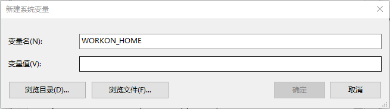
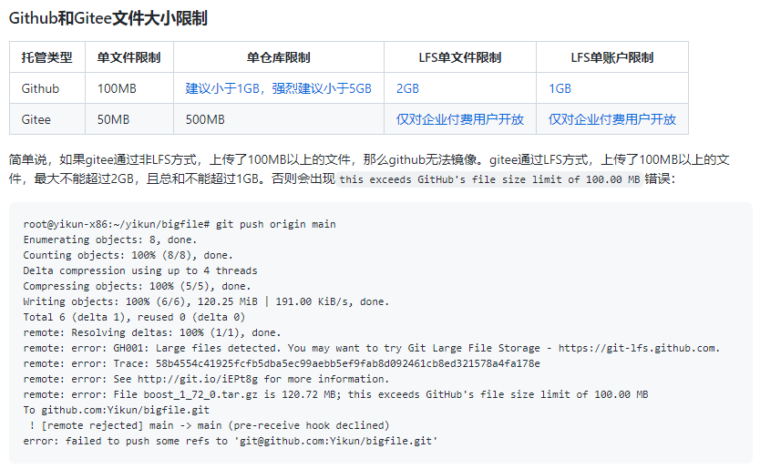

# InvestmentNotebook

Jyputer notebook for investment research.


## 项目结构说明

- notebook:

    各种 Jupyter Notebook 。

- data:

    测试用数据。下载后需要解压在 data/ 文件夹下。

- src:

    在 Jupyter 推演后形成的的 Python 文件。

- pictures: 各种图片。


## 依赖库（requirement）

- requests

    http 库。

- lxml

    网页解析。

- numpy

    科学计算。
    
- pandas

    科学计算。

- peewee

    数据库 ORM。

- matplotlib

    绘图。


## 环境搭建

### Windows

基于 Windows 10 x64，因为 Python 3.9 起不再支持 Windows 7，且默认为 64 位。

1. 安装 Python

    [Python 官网](https://www.python.org/)，挑一个不那么新的版本（因为可能其它第三方库还没有更新）。

    本项目使用 [Python 3.8.9](https://www.python.org/ftp/python/3.8.9/python-3.8.9-amd64.exe) 编写。
      
    安装时最好自定义安装路径，安装到 C:\Python 之类比较简单的地方，以便于后续安装、使用的时候在 CMD 窗口输入路径。

2. 安装 Python 虚拟环境

    程序写的多了之后，就会遇到在同一台电脑上运行不同的程序：

        - 需要不同版本的 Python；
        - 相同版本的 Python，但是依赖库的版本不同；
        - 不希望把不同程序的依赖库混在一起。


    虚拟环境是用来处于这个目的，用来建立“软隔离”（硬隔离就是一台电脑一个程序，壕无人性）的工具。

    1. 安装 virtualenv
      
        ```
        pip install virtualenv
        ```
      
    2. 安装 virtualenvwrapper-win
      
        ```
        pip install virtualenvwrapper-win
        ```
      
    3. 配置 virtualenvwrapper-win
      
        默认情况下，新建的虚拟环境位于 C:\Users\<用户名>\Envs 下面。
         
        如果要改变这个位置：Windows 菜单 -> 设置 -> 系统 -> 关于（在左侧） -> 高级系统设置（在右侧） -> 环境变量 -> 新建系统变量，如下图：
         
        

    4. 使用
    
        1. 创建虚拟环境
        
            ```
            mkvirtualenv <ENV> [-a project_path]
            ```
        
        2. 使用虚拟环境
        
            ```
            workon <ENV>
            ```
        
        3. 退出虚拟环境
        
            ```
            deactivate
            ```
        
        4. 查看所有的虚拟环境
        
            ```
            workon
            ```
        
3. 安装 Nodejs

    Nodejs 是 JupyterLab 的 Extesion manager（扩展管理器）运行需要的依赖，JupyterLab 本身不需要。
    
    [在 Nodejs 官网下载](https://nodejs.org/zh-cn/download/)，用默认值安装即可。

4. 安装 JupyterLab

    1. 创建虚拟环境
    
       ```
       mkvirtualenv <ENV>
       ```
       
       可以先建立一个纯粹的 JupyterLab 虚拟环境，安装好必须的库，以后可以用 `cpvirtualenv ENVNAME [TARGETENVNAME]` 来复制一个工作用的 JupyterLab 环境。
       
       或者每次都从头创建。
       
       我们的例子中用 Jupyter 做虚拟环境名称，路径位于 D:\Jupyter。
       
       ```
       # 如果 D:\Jupyter 文件夹还不存在：
       mkdir D:\Jupyter
       
       mkvirtualenv Jupyter -a D:\Jupyter
       ```
       
       CMD 窗口的提示符会有变化，最前面以 (Jupyter) 开头，表示位于虚拟环境中。
       
       以下步骤均须在虚拟环境中操作，切换至虚拟环境使用：`workon Jupyter`。
       
    2. 安装 JupyterLab
    
        ```
        pip install JupyterLab
        ```
        
    3. 启动
    
        ```
        > jupyter lab
        ```

5. 其它可选工具

    1. git
    
        git 是一个版本管理工具，教程在[这里](https://git-scm.com/book/zh/v2)，下载在[这里](https://git-scm.com/downloads)。
        
        同时有几个 git 托管平台，[GitHub](https://github.com/)（可能要翻墙）、[GitLab](https://gitlab.com/)（可能要翻墙）、[Gitee](https://gitee.com/)（国内的）。
        

## 项目历史

## 期货部分

- [Tick数据](tick数据.ipynb)
- [Tick转Bar](tick转bar.ipynb)
- [过滤](过滤.ipynb)
- [时区](时区.ipynb)
- [交易时间](交易时间.ipynb)
- [Tick转Bar（第2部分）](tick转bar_第2部分.ipynb)


## 股票部分

精力不够，推后实现。

## 数据文件的说明

在本地运行本项目的 .ipynb 文件（Jupyter 文件）之前，请将 data/ 文件夹下的压缩文件解压出来，放在 data/ 文件夹下。

因为 csv 格式的 Tick 文件容量巨大，而 GitHub、Gitee 平台对项目容量有限制（毕竟硬盘要花钱啊）：


